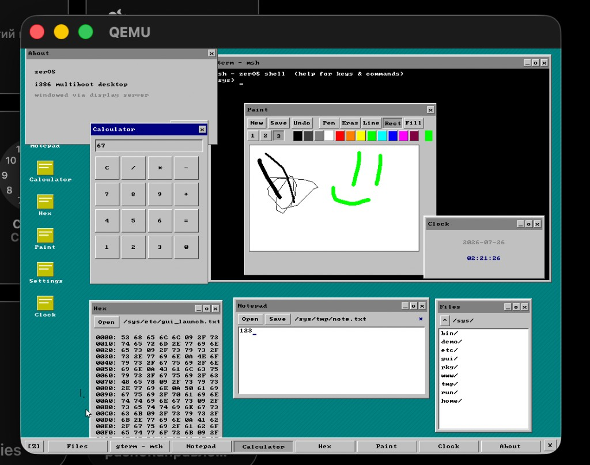

# zerOS

Bare-metal **i386** micro-OS: Multiboot kernel, cooperative processes, in-memory ramfs, virtio networking, and a Win95-flavoured GUI desktop — all freestanding, no libc.



| | |
|---|---|
| Arch | IA-32, Multiboot, flat memory (no MMU) |
| Isolation | rings 0/3, identity map |
| Init | `zerosd` (unit-file PID 1) |
| FS | ramfs; initrd blob in kernel `.rodata` |
| Net | virtio-net + custom IPv4/TCP/UDP/ICMP |
| Userland | ET_EXEC ELF (Zig freestanding) |
| Display | VGA text **or** VESA framebuffer GUI |
| Footprint | `kernel.elf` ~ few hundred KiB with initrd |

```
GRUB ──► kernel.elf ──► unpack initrd ──► zerosd
                                              │
                    local-fs ──► netd ──► msh / desktop session
```

---

## Quick start

**Needs:** `nasm`, `zig`, `python3`, `qemu-system-i386`, `xorriso` (for ISO).

```bash
make all          # kernel + userland + initrd + image
make run          # QEMU (serial on stdio; GUI if session starts)
make test         # host minipy regression suite
```

Console telemetry: COM1 (`-serial stdio`) and Bochs port `0xE9`.

---

## Desktop (GUI)

Boot into framebuffer mode; `session` starts the window manager.

| Component | Path | Role |
|---|---|---|
| `wm` | `/sys/gui/wm.win` | Window manager, wallpaper, icons, taskbar |
| `launchpad` | `/sys/gui/launchpad.win` | Start-menu popup (`[Z]` on the taskbar) |
| `gterm` | | Terminal (Ctrl+C kills child) |
| `files` / `notepad` | | Browser + editor (Open dialogs, clipboard) |
| `calc` / `hex` / `paint` / `settings` | | Extra desktop apps |

**Desktop icons** come from `/sys/etc/gui_desktop.txt` (double-click to launch). **Alt+Tab** cycles windows. Edges/corners resize hosted apps; dragging a maximized window restores then moves it. PC speaker beeps on session start and some UI actions (`SYS_BEEP`).

**Taskbar:** `[Z]` opens launchpad (left); `X` exits the session (right).

**Clipboard:** `SYS_CLIP_SET` / `SYS_CLIP_GET` — Notepad Ctrl+C/V, Files Ctrl+C copies path.

**Network:** `/sys/etc/network.conf` (`ip=`/`mask=`/`gw=`/`dns=`) or QEMU SLIRP defaults.

**Shell pipes:** `msh` supports `cmd | cmd` via `SYS_PIPE`.

---

## Boot & architecture

1. GRUB loads `/boot/kernel.elf` (Multiboot `0x1BADB002`, load at 1 MiB).
2. `entry.asm` installs a flat GDT (kernel/user code+data + TSS) and jumps to `kernel_main`.
3. Init order:

```
tty → mm → IDT → PIT@100Hz → vfs → initrd → proc → syscalls → net → zerosd
```

Initrd is **not** a Multiboot module: `scripts/pack_initrd.py` packs `initrd/` into a TLV blob that is `INCBIN`’d into the kernel.

**No paging.** Physical == virtual. The ELF loader writes `PT_LOAD` into a fixed VMA per program. Scheduling is cooperative / blocking (`spawn` → `wait`); the timer tick does not preempt user code.

---

## Shell & network tools

`msh` is the interactive shell. Useful builtins / bins:

```text
ls  tree  cat  cp  rm  mv  mkdir  touch
ping  dns  ifconfig  curl  wget  nc  telnet
httpd  sshd  ssh          # cleartext lab tools, not OpenSSH/TLS
python                    # guest minipy
desktop / session         # enter GUI
```

Host-side while guest servers run (SLIRP):

```bash
curl -s http://127.0.0.1:8080/
nc 127.0.0.1 2222
```

---

## minipy

One language core, two envelopes (host `MP_HOST` and guest via syscalls): ints/bools/strings/lists, `def`/`if`/`while`/`for`/`import`, small VFS.

```bash
make host && ./host/minipy
make test                 # ./host/test_runner tests/cases.txt
```

---

## Tree

```
typewriter/
├── boot/ entry.asm, linker.ld, grub.cfg
├── kernel/          mm vfs proc elf syscall zerosd pci net gui
├── user/
│   ├── lib/         libmp (syscalls + GUI ABI)
│   ├── guic/        widget toolkit
│   ├── gui/         wm, launchpad, gterm, files, …
│   ├── shell/       msh
│   └── util/ net/   classic userland
├── py/              minipy
├── initrd/          seed tree (etc/, gui_launch.txt, …)
├── host/            host minipy + test_runner
├── scripts/         pack_initrd.py
└── Makefile
```

Build artefacts live under `out/` (gitignored). Packed binaries under `initrd/bin` and `initrd/gui` are regenerated by `make`.

---

## Non-goals

No glibc, paging/ASLR, preemptive SMP, pipes/job control, DAC, TLS, or real DHCP. `curl`/`ssh` here are cleartext lab clients over the in-tree stack.

---

## Status

ABI and GUI toolkit are still moving. Best entry points: `boot/entry.asm` → `kernel_main` → `zerosd` → `msh` / `wm`.
